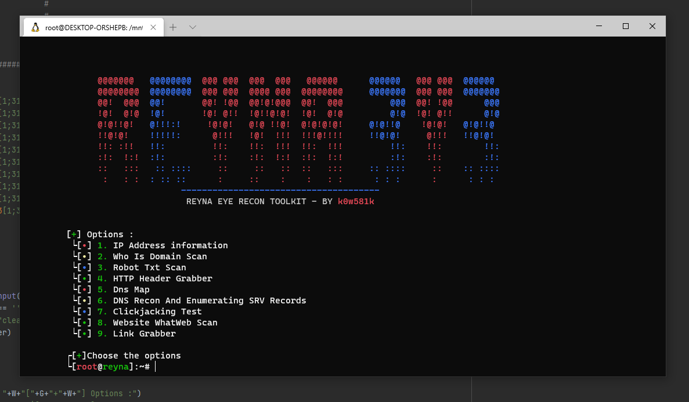

<p align="center">
  
</p>
<div align="center"> 
  <a href="https://github.com/naimkowshik/LBFH">
    
  </a>
  <a href="https://www.python.org/">
    
  </a>
  <a href="https://twitter.com/K0WSHIK">
    
  </a>
  <a href="https://www.jetbrains.com/pycharm/download/#section=windows">
    
  </a>
</div>
<br />

**ONLY DOWNLOAD IT HERE, DO NOT TRUST OTHER PLACES.**

Written by: [ **TeamKurais** ]-[ **Twitter** ] [@K0WSHIK](https://twitter.com/K0WSHIK), [ **GitHub** ] [@naimkowshik](https://github.com/naimkowshik)

## 🔖 About

We have created this tool that many new people come in the world of pen testing & Ethical Hacking. They do not know much about the basics. So this tool has been created to help them. I hope you share this tool with your new friends.

[ **DISCLAIMER** ] **:** This is only for testing purposes and can only be used where strict consent has been given. Do not use this for illegal purposes, period.

# 📃 Features
#### [ Menu ] :
* IP Address information
* Who Is Domain Scan
* Robot Txt Scan
* HTTP Header Grabber
* Dns Map
* DNS Recon And Enumerating SRV Records
* Clickjacking Test
* Website WhatWeb Scan
* Link Grabber

## 📝 Bugs and enhancements

For bug reports or enhancements, please open an [issue](https://github.com/naimkowshik/reyna/issues) here.


## 🎨 Tested on
* Kali linux 
* Parrot-Sec 

# ⏳ Installation

**make sure your apt-get isn't broken before you run this**

**RUN THIS AS ROOT**

```bash
$ git clone https://github.com/naimkowshik/reyna.git
$ cd reyna
$ chmod +x setup.py
$ python3 setup.py
$ python3 reyna.py
```

# 📸 SCREENSHOT
